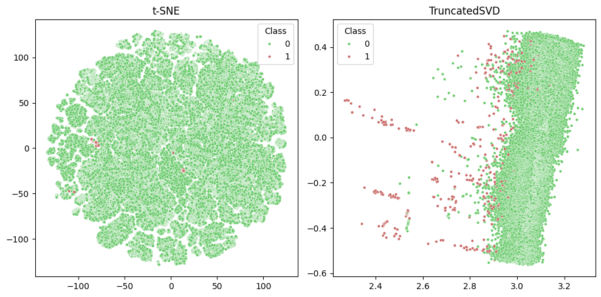
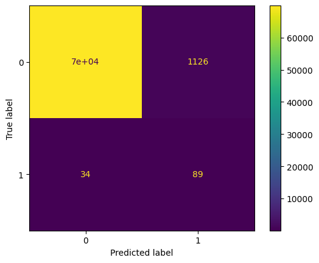
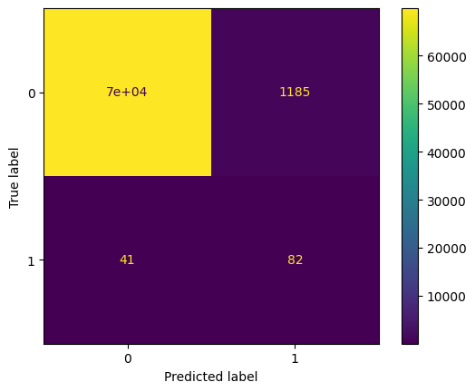
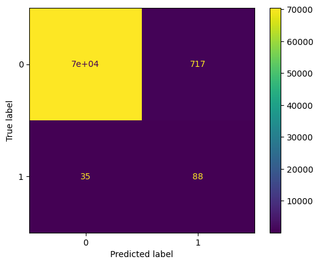
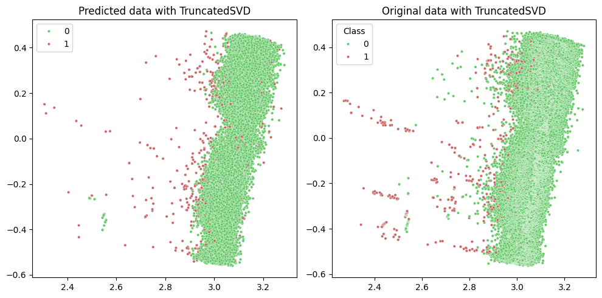

# Credit Card Fraud Detection
[Kaggle dataset](https://www.kaggle.com/datasets/mlg-ulb/creditcardfraud)

**GOAL:** predict whether the transaction is fraud or not.  
**BEST SCORE:** 0.99 Accuracy (best model - DBSCAN)

---
## Architecture

#### EDA

The features:
1. Time - Number of seconds elapsed between this transaction and the first transaction in the dataset
2. V1-V28 - Result of a PCA Dimensionality reduction to protect user identities and sensitive features
3. Amount - Transaction amount
4. Class - 1 for fraudulent transactions, 0 otherwise

Dataset is highly unbalanced, the positive class (frauds) account for 0.172% of all transactions (492 of 284807).

### Different models

**`Isolation Forest`**

Total metrics:
|                      |   Test   |
|----------------------|----------|
|            Accuracy: | 0.98     |
| Predicted anomalies: | 0.4266 % |

**`One-Class SVM`**

Total metrics:
|                      |   Test   |
|----------------------|----------|
|            Accuracy: | 0.98     |
| Predicted anomalies: | 0.4449 % |

**`Local Outlier Factor`**

Total metrics:
|                      |   Test   |
|----------------------|----------|
|            Accuracy: | 0.98     |
| Predicted anomalies: | 0.4252 % |

**`DBSCAN`**

Total metrics:
|                      |   Test   |
|----------------------|----------|
|            Accuracy: | 0.99     |
| Predicted anomalies: | 0.2826 % |

